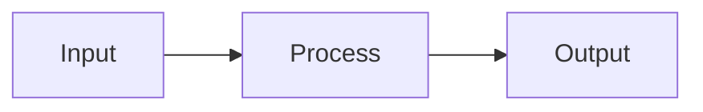
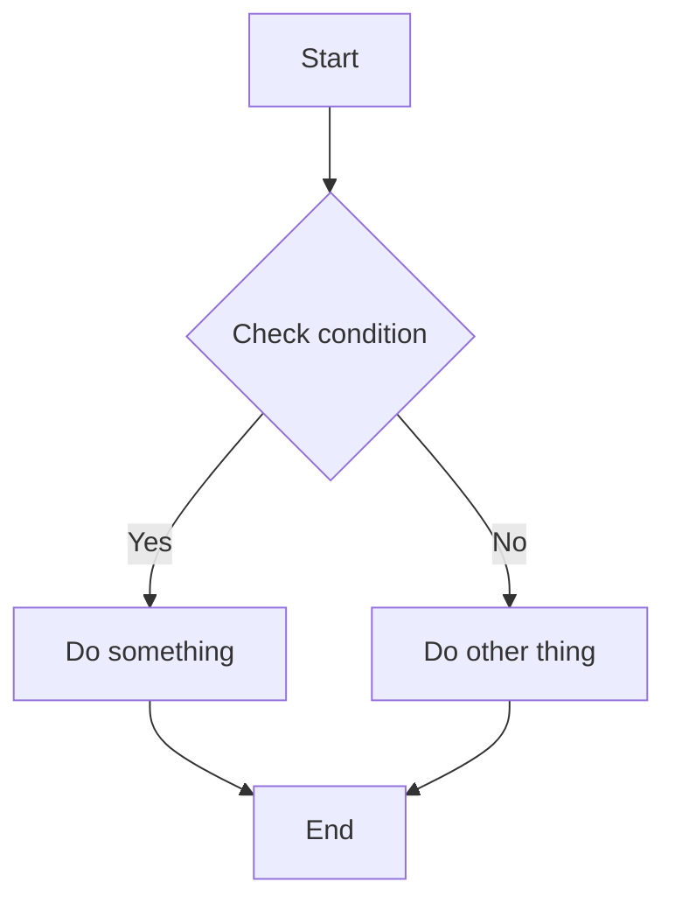
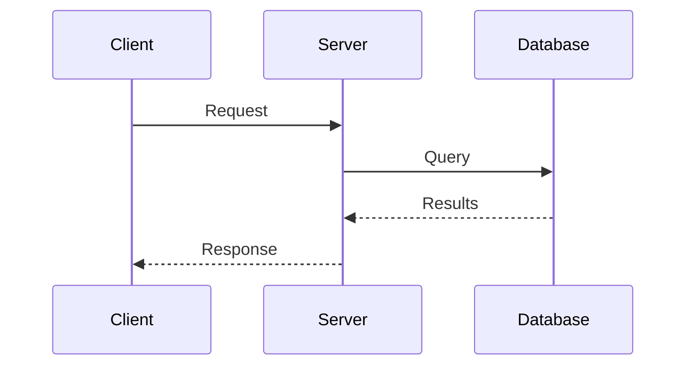
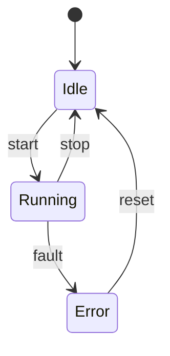

# Mermaid Filter

The Mermaid filter converts Mermaid diagram code blocks into rendered images for inclusion in \ac{PDF} output.

## Location

```
latex/filters/pandoc-mermaid.py
```

## Purpose

Mermaid is a text-based diagramming language that produces flowcharts, sequence diagrams, state machines, and more. This filter enables writing diagrams in Markdown and having them rendered automatically.

## Prerequisites

The filter requires:

- Node.js and npm
- Mermaid \ac{CLI} (`@mermaid-js/mermaid-cli`)
- Chromium or Chrome (for headless rendering)

Install via:

```bash
npm install @mermaid-js/mermaid-cli@10.9.1
```

## Syntax

Use fenced code blocks with the `mermaid` language identifier:

````markdown

````

## Supported Diagram Types

| Type | Keyword | Description |
|------|---------|-------------|
| Flowchart | `graph` or `flowchart` | Process flows and decision trees |
| Sequence | `sequenceDiagram` | Interaction sequences |
| Class | `classDiagram` | \ac{UML} class diagrams |
| State | `stateDiagram-v2` | State machines |
| ER | `erDiagram` | Entity-relationship diagrams |
| Gantt | `gantt` | Project timelines |
| Pie | `pie` | Pie charts |

## Examples

### Flowchart

````markdown

````

### Sequence Diagram

````markdown

````

### State Diagram

````markdown

````

## Configuration

### Mermaid Config

Customize diagram appearance in `config/mermaid-config.json`:

```json
{
  "theme": "default",
  "themeVariables": {
    "nodeBorder": "#004990",
    "mainBkg": "#c9d7e4",
    "nodeTextColor": "#274059"
  }
}
```

### Puppeteer Config

Configure Chromium in `config/puppeteer.json`:

```json
{
  "executablePath": "/usr/bin/chromium",
  "args": ["--no-sandbox"]
}
```

## Processing

The filter:

1. Detects Mermaid code blocks
2. Writes content to temporary file
3. Invokes `mmdc` to render \ac{PNG}/\ac{PDF}
4. Replaces code block with image reference
5. Cleans up temporary files

Output images are stored in `build/mermaid_images/`.

## Troubleshooting

### Diagrams Not Rendering

Check that mmdc is installed:

```bash
./node_modules/.bin/mmdc --version
```

### Sandbox Errors

Add to `puppeteer.json`:

```json
{
  "args": ["--no-sandbox", "--disable-setuid-sandbox"]
}
```

### Wrong Chromium Path

Update `executablePath` in `puppeteer.json` to match your system:

- Arch: `/usr/bin/chromium`
- Ubuntu: `/usr/bin/chromium-browser`
- Snap: `/snap/bin/chromium`

## Limitations

- Interactive features (clicks, tooltips) don't work in \ac{PDF}
- Very large diagrams may need manual sizing
- Some advanced Mermaid features require specific versions
